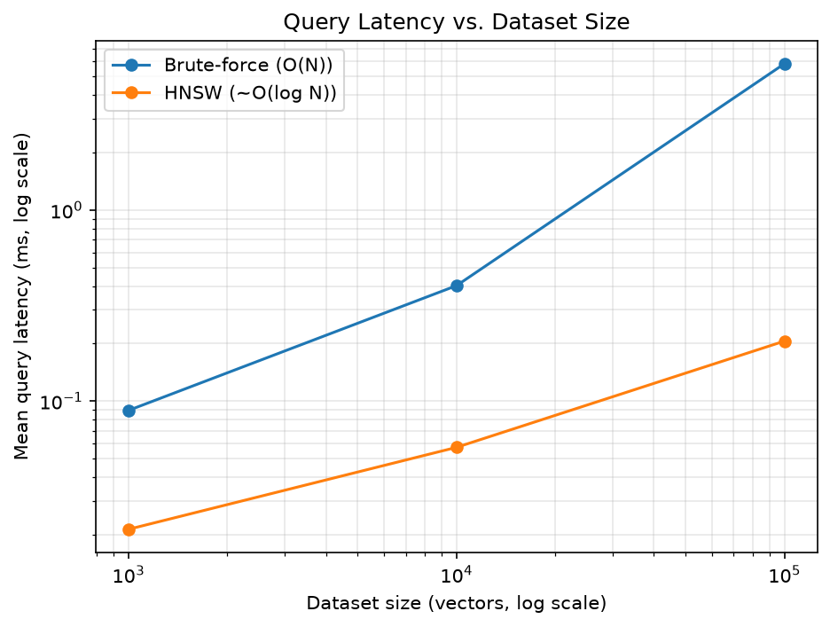
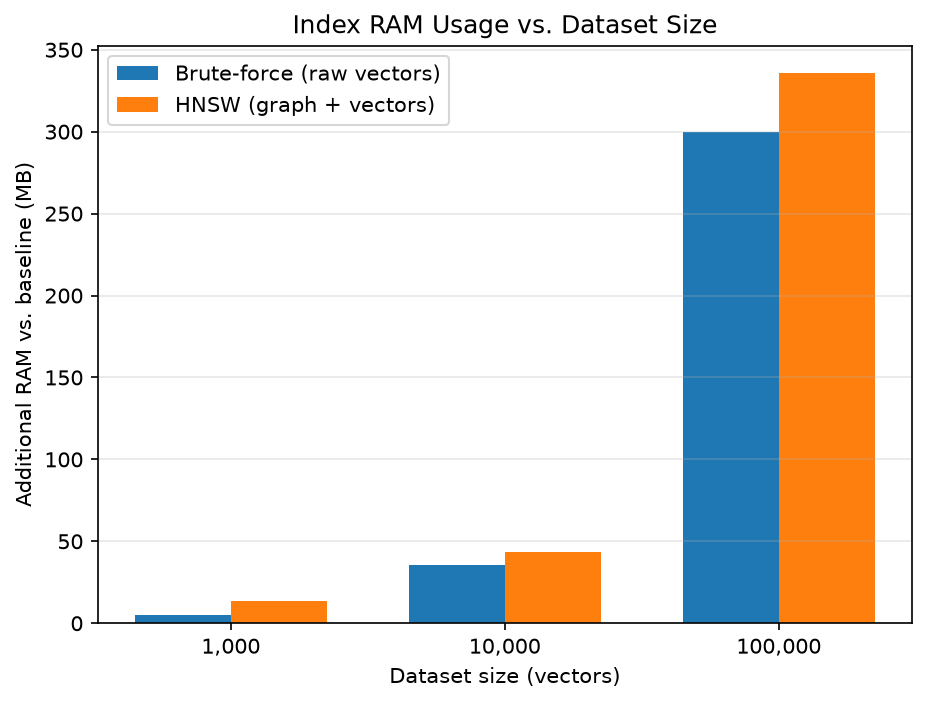

# HNSW vs. Brute-Force Vector Search Benchmark

An educational benchmark comparing exact brute-force nearest-neighbor search against
HNSW (Hierarchical Navigable Small World) approximate search, to show concretely why
HNSW matters once a vector index grows past a few thousand items.

Code: [`vector-search-benchmark/benchmark.py`](vector-search-benchmark/benchmark.py)

## How HNSW Works

### Graph construction

HNSW builds a multi-layer graph over the indexed vectors instead of a flat list:

- Each vector becomes a node. Nodes are inserted one at a time; each insertion is
  randomly assigned a "top layer," and the node exists in every layer from there down
  to layer 0. Higher layers are sparse (few nodes, long-range links), layer 0 contains
  every node (dense, short-range links) — like a skip list, but for similarity instead
  of sorted order.
- `M`: the max number of bidirectional links each node keeps per layer. Higher M means
  a denser, more accurate graph, but more RAM and a slower build.
- `ef_construction`: while inserting a new node, the index runs a greedy graph search
  to find the best M neighbors to link it to. Higher `ef_construction` searches more
  thoroughly before picking those links, producing a higher-quality graph at the cost
  of slower builds.

### Search

- A query starts at a fixed entry point in the topmost layer and greedily walks toward
  whichever neighbor is closest to the query, until no neighbor improves on the current
  best — then it drops down one layer and repeats, using the previous layer's best node
  as the new starting point.
- At layer 0, instead of tracking just the single best node, the search keeps a
  candidate list of size `ef_search` and expands it by visiting each candidate's
  neighbors. A larger `ef_search` means more of the graph gets explored before
  settling on the final top-k, which raises the odds the *true* nearest neighbors are
  among the candidates (higher recall) at the cost of visiting more nodes per query
  (higher latency).
- Routing through long-range links at the top layers first, then narrowing down,
  is why HNSW query time scales roughly O(log N) instead of brute force's O(N): each
  layer prunes the search space geometrically rather than scanning every vector once.

## Recall vs. Latency Trade-off

`ef_search` is a query-time-only knob — changing it doesn't require rebuilding the
index — which is what makes it the natural dial for trading speed against accuracy.
Swept `ef_search` ∈ [10, 50, 100, 200, 500] on a 100,000-vector index
(`M=16`, `ef_construction=200`):

| ef_search | Mean Query (ms) | Recall@10 |
|---|---|---|
| 10  | 0.106 | 0.771 |
| 50  | 0.213 | 0.986 |
| 100 | 0.257 | 0.998 |
| 200 | 0.312 | 0.999 |
| 500 | 0.608 | 0.999 |

Recall climbs steeply from `ef_search` 10→100 (77%→99.8%) then flattens — past
`ef_search` ≈ 200 there's almost nothing left to gain, only added latency. This is the
classic ANN-benchmarks "knee" curve: the useful operating range is the steep part, not
the tail.

## Benchmark Results

Brute-force (exact, O(N) scan) vs. HNSW (`M=16`, `ef_construction=200`,
`ef_search=50`), 384-dim vectors, 100 queries/size:

| Dataset Size | Method | Build Time | Index RAM | Mean Query (ms) | p95 (ms) | Recall@10 |
|---|---|---|---|---|---|---|
| 1,000 | Brute-force | 0.0012s | 5.0 MB | 0.089 | 0.268 | 1.0000 (exact) |
| 1,000 | HNSW | 0.0175s | 13.7 MB | 0.021 | 0.028 | 1.0000 |
| 10,000 | Brute-force | 0.0122s | 35.3 MB | 0.402 | 0.788 | 1.0000 (exact) |
| 10,000 | HNSW | 0.3093s | 43.7 MB | 0.057 | 0.074 | 0.9990 |
| 100,000 | Brute-force | 0.1050s | 300.1 MB | 5.834 | 7.536 | 1.0000 (exact) |
| 100,000 | HNSW | 5.7193s | 335.7 MB | 0.206 | 0.282 | 0.9850 |

### Key takeaways

- **Speed**: at 100,000 vectors, HNSW answers queries 28.3x faster than brute force
  (0.206ms vs 5.834ms mean).
- **Scaling**: brute-force latency grows ~65x across the 100x size increase
  (1k→100k); HNSW only grows ~10x — the O(N) vs O(log N) divergence, visualized.
- **Accuracy cost**: HNSW gives up only 1.5% recall (98.5% vs exact) at 100,000
  vectors for that speedup.
- **RAM cost**: HNSW's graph adds ~12% more memory than storing the raw vectors alone
  (+35.6 MB at 100k).
- **Bottom line**: past roughly 10k vectors, brute-force's linear scan cost starts to
  dominate, and HNSW's small accuracy/RAM trade-off is worth it for an
  order-of-magnitude (or more) latency win.

Data is synthetic (seeded Gaussian-mixture clusters, not pure random noise — see
`generate_clustered_dataset` in `benchmark.py` for why pure random noise gives
misleadingly bad HNSW recall in high dimensions).
